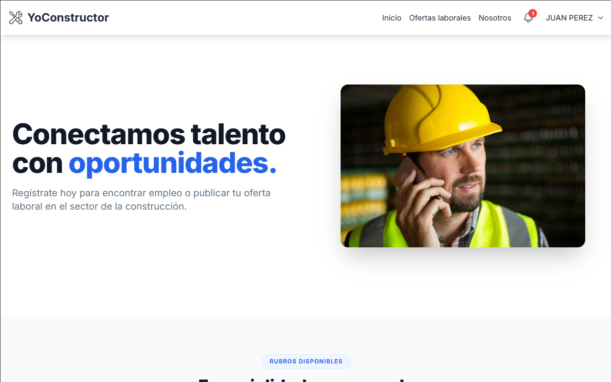
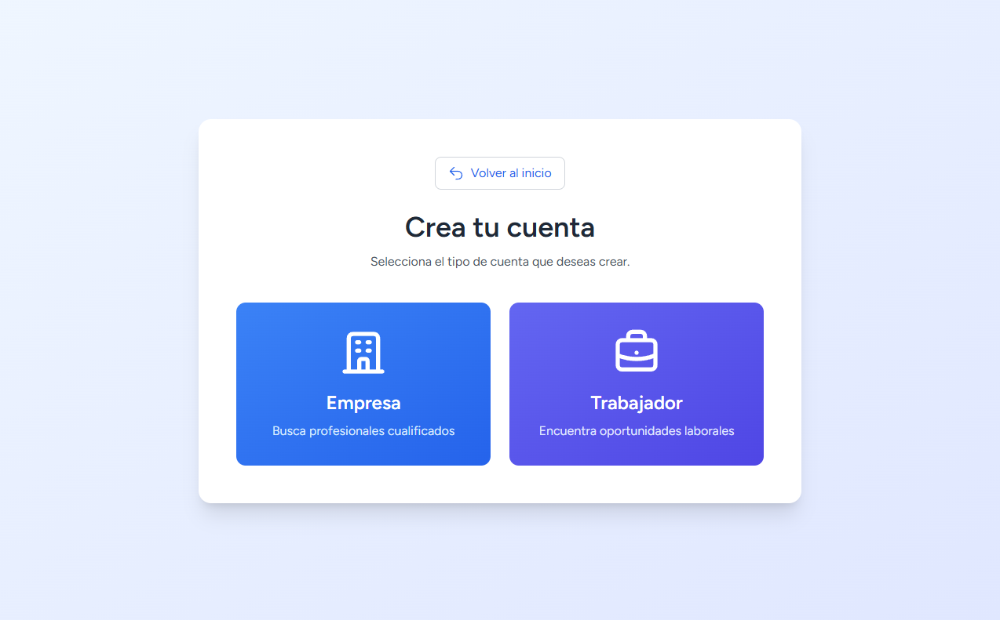
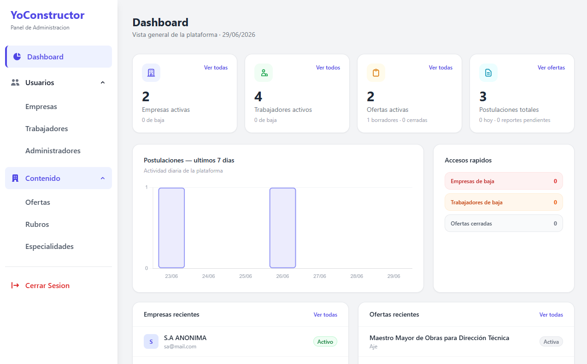
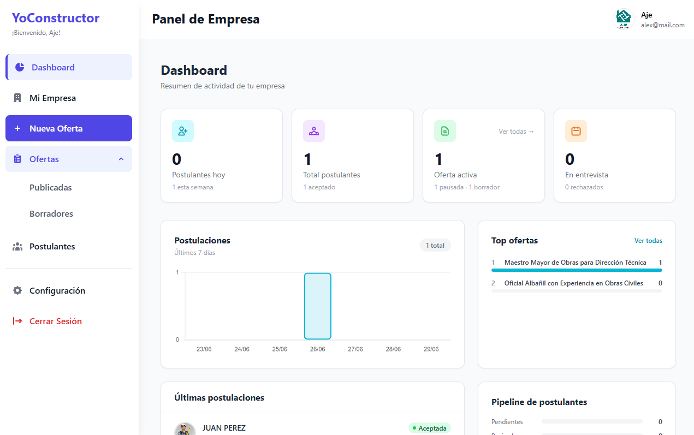
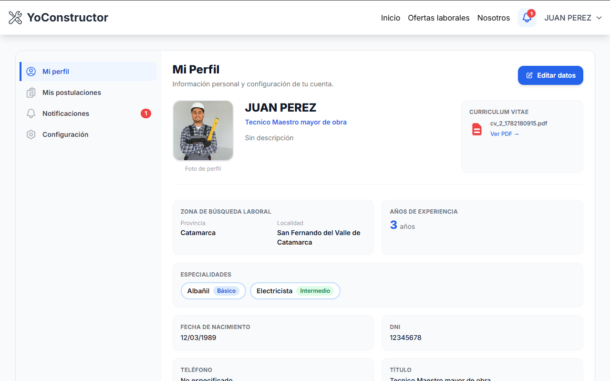

# YoConstructor V2

YoConstructor V2

Plataforma de empleo para el sector de la construcción desarrollada con Laravel 11.

Migración completa desde PHP Vanilla para aprender arquitectura moderna,
buenas prácticas y desarrollo asistido por IA.


> Migración de [YoConstructor V1](https://github.com/ortizmirandapm/yoconstructor) — desarrollado originalmente en PHP vanilla/MySQL/TailwindCSS.

---
## 🚀 Objetivos

-   Aplicar Laravel en un proyecto real.
-   Mejorar mantenibilidad y escalabilidad.
-   Experimentar con desarrollo asistido por IA mediante OpenCode.

---

## 🧠 Desarrollo asistido por IA

Durante la migración utilicé OpenCode junto con **AGENTS.md** y skills
(Laravel Patterns, PHP Pro, Front-end Design, Tailwind CSS Patterns,
Accessibility y Node.js Patterns). La IA aceleró tareas repetitivas y
ayudó a mantener consistencia, mientras que las decisiones de
arquitectura y revisión del código fueron realizadas manualmente.

## Características

- Registro diferenciado para **empresas** (CUIT) y **trabajadores** (DNI)
- Publicación y gestión de ofertas laborales con especialidades, rubro, modalidad y rango salarial
- Sistema de **notificaciones automáticas** por matching de especialidades (Laravel Observers)
- Postulaciones con seguimiento de estado (Pendiente → Revisada → Entrevista → Aceptada/Rechazada)
- Panel de administración con gestión de usuarios, empresas y ofertas
- Página pública de ofertas con filtros por especialidad, provincia y modalidad
- Perfil editable para empresas y trabajadores
- Protección de recursos por tipo de usuario (middlewares + policies)

---

## Stack

- **Backend:** Laravel 11, PHP 8.2
- **Frontend:** Blade, TailwindCSS, Vite
- **Base de datos:** MySQL
- **Auth:** Laravel Breeze
- **Notificaciones:** Laravel Notifications (driver: database)
- **Herramientas:** Eloquent ORM, Observers, Policies, Seeders

---

## 📸 Capturas

### Página principal



---

### Registro



---

### Panel de Administración



---

### Panel Empresa



---

### Panel Trabajador




## Instalación local

### Requisitos
- PHP 8.2+
- Composer
- Node.js 18+
- MySQL

### Pasos

```bash
# 1. Clonar el repositorio
git clone https://github.com/ortizmirandapm/yoconstructor-v2.git
cd yoconstructor-v2

# 2. Instalar dependencias PHP
composer install

# 3. Instalar dependencias Node
npm install

# 4. Configurar el entorno
cp .env.example .env
php artisan key:generate
```

Editá el `.env` con tus credenciales de base de datos:

```env
DB_DATABASE=yoconstructor_v2
DB_USERNAME=root
DB_PASSWORD=
```

```bash
# 5. Crear las tablas y poblar datos iniciales
php artisan migrate
php artisan db:seed

# 6. Compilar assets
npm run dev

# 7. Levantar el servidor
php artisan serve
```

La app queda disponible en `http://localhost:8000`.

### Crear usuario admin

```bash
php artisan tinker
```

```php
\App\Models\User::create([
    'name'    => 'Admin',
    'email'   => 'admin@yoconstructor.com',
    'password' => bcrypt('password'),
    'tipo'    => 'admin',
    'estado'  => true,
]);
```

---

## Estructura de roles

| Rol | Acceso |
|-----|--------|
| `trabajador` | Perfil, especialidades, postulaciones, notificaciones |
| `empresa` | Ofertas CRUD, postulaciones recibidas, perfil de empresa |
| `admin` | Panel de administración completo |

---

## Módulos principales

```
app/
├── Http/Controllers/
│   ├── Admin/          # AdminController, UsuarioController, EmpresaController, OfertaAdminController
│   ├── Empresa/        # OfertaController, PostulacionController, PerfilController
│   └── Trabajador/     # PostulacionController, PerfilController, NotificacionController
├── Models/             # User, Empresa, Trabajador, Oferta, Especialidad, Postulacion...
├── Observers/          # OfertaObserver — notificaciones automáticas por matching
├── Notifications/      # NuevaOfertaMatch
└── Policies/           # OfertaPolicy
```

---

## 🛣️ Roadmap

-   [x] Migración a Laravel 11
-   [x] CRUD principales
-   [x] Paneles
-   [ ] Tests
-   [ ] CI/CD
-   [ ] Docker
-   [ ] Integración con IA
-   [ ] Chatbot
-   [ ] Recomendador de ofertas

## Autor

**Pablo Ortiz Miranda**

- LinkedIn: [linkedin.com/in/ortizmirandapm](https://linkedin.com/in/ortizmirandapm)
- Email: ortizmirandapm@gmail.com

---

## Versión anterior

YoConstructor V1 — PHP vanilla, MySQL, TailwindCSS
👉 [github.com/ortizmirandapm/yoconstructor](https://github.com/ortizmirandapm/yoconstructor)
